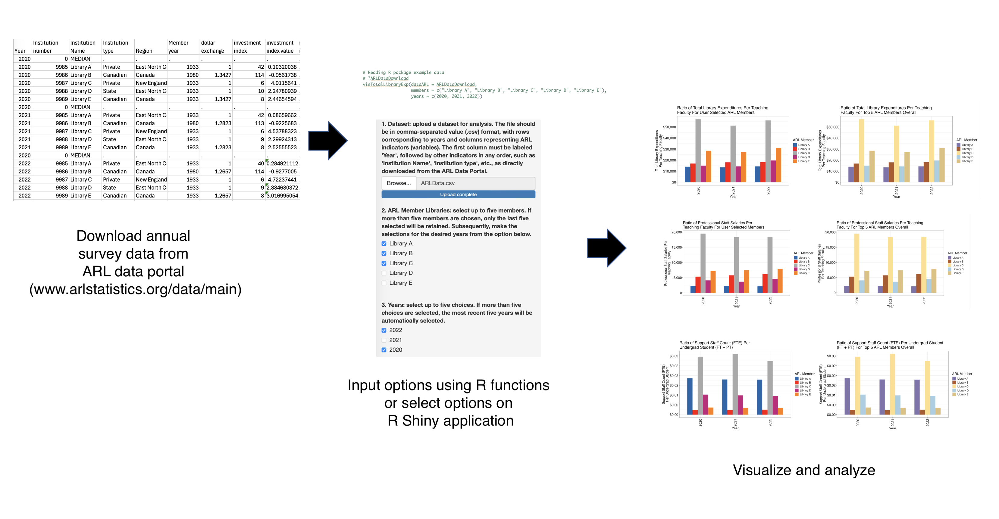
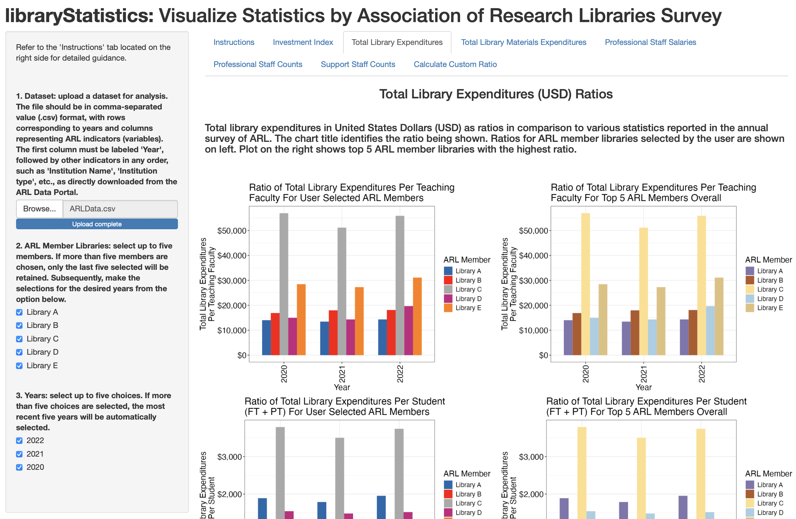

<!-- README.md is generated from README.Rmd. Please edit that file -->

# libraryStatistics

An R Package with a Shiny Dashboard for Visualizing and Comparing
Library Statistics Data from Association of Research Libraries

<!-- badges: start -->

[](https://github.com/anjalisilva/MPLNClust/issues)
[](./LICENSE)


<!-- https://shields.io/category/license -->
<!-- badges: end -->

## Description

`libraryStatistics` is an R package with a Shiny dashboard that permits
to visualize and compare data from the annual survey of Association of
Research Libraries (ARL; URL: www.arlstatistics.org/data/main). ARL data
describes the collections, staffing, expenditures, and service
activities of the ARL member libraries in the United States and Canada.
This R package is designed for the analysis and visualization of library
statistics published from the annual survey. Both the R package and
Shiny application enables the generation of statistical ratios for
comparative analyses. Through the interactive interface of the Shiny
application, users can dynamically visualize ratios by selecting ARL
member libraries, years, and also by creating custom ratios, which
enhances the usability of the published ARL data. Library statistics
data published from the annual ARL survey can be downloaded from ARL
Data Portal for any number of years and across any number of ARL member
libraries. However, at one time, both the R package and Shiny
application would only enable to perform analysis on 5 ARL member
libraries and 5 distinct years. The `libraryStatistics` package was
developed using `R version 4.3.2 (2023-10-31)`,
`Platform: x86_64-apple-darwin20 (64-bit)` and
`Running under: macOS Ventura 13.2`.

## Installation

To install the latest version of the package:

``` r
require("devtools")
devtools::install_github("anjalisilva/libraryStatistics", build_vignettes = TRUE)
library("libraryStatistics")
```

To run the Shiny application (under construction):

``` r
libraryStatistics::shinyLibStats()
```

## Overview

To list all functions available in the package:

``` r
ls("package:libraryStatistics")
data(package = "libraryStatistics")
browseVignettes("libraryStatistics>")
```

`libraryStatistics` contains 8 functions.

1.  ***shinyLibStats*** opens the Shiny application/dashboard which
    permit to perform visual comparisons of up to 5 ARL member libraries
    and up to 5 years, at one time, from user uploaded ARL annual survey
    data.
2.  ***visTotalLibraryExp*** permits to visualize total library
    expenditures in United States Dollars (USD) as ratios in comparison
    to various statistics reported in the annual survey of ARL as bar
    plots. This ratio shows question 6 on ARL survey as the numerator.
3.  ***visTotalLibMaterialsExp*** permits to visualize total library
    materials expenditures in United States Dollars (USD) as ratios in
    comparison to various statistics reported in the annual survey of
    ARL as bar plots. This ratio shows question 7 on ARL survey as the
    numerator.
4.  ***visProfStaffSalaries*** permits to visualize salaries of
    professional library staff in United States Dollars (USD), as ratios
    in comparison to various statistics reported in the annual survey of
    ARL as bar plots. This ratio shows question 8a on ARL survey as the
    numerator.
5.  ***visProfStaffCounts*** permits to visualize library professional
    staff counts, full-time equivalent (FTE), as ratios in comparison to
    various statistics reported in the annual survey of ARL as bar
    plots. This ratio shows question 13a on ARL survey as the numerator.
6.  ***visSupStaffCounts*** permits to visualize library support staff
    counts, full-time equivalent (FTE), as ratios in comparison to
    various statistics reported in the annual survey of ARL as bar
    plots. This ratio shows question 13b on ARL survey as the numerator.
7.  ***customRatioBuilder*** permits to build and visualize a custom
    ratio based on user selected numerator and denominator from various
    statistics reported in the annual survey of ARL.
8.  ***indexTableGenerator*** permits to build a table containing ARL
    Investment Index over years as reported in the annual survey.

An overview of the package is illustrated below:

<div style="text-align:center">



<div style="text-align:left">

<div style="text-align:left">

## Details

The R package and Shiny dashboard permit to visualize, track trends, and
compare data downloaded directly from the ARL data portal
(www.arlstatistics.org/data/main), with no data cleaning involved. At
one time, up to 5 ARL member libraries and 5 distinct years can be
compared using this tool. The tool is designed for the analysis of
library statistics published from the annual survey conducted by the
ARL. The R package contain functions that permit the user to read in
data downloaded from the ARL Data Portal and perform visual comparisons
using ratios. The input data file should be in comma-separated value
(.csv) format as directly downloaded from the ARL Data Portal. Users
must ensure that all variables are selected when downloading data, with
columns set to ‘Variables’ and the data sorted by ‘Institution Name’
(which are the default options on ARL Data Portal). As such the first
column must be labeled ‘Year’, followed by other indicators in any
order, such as ‘Institution Name’, ‘Institution type’, etc., as directly
downloaded from the ARL Data Portal. Data may be downloaded for any
number of years and across any number member libraries/institutions (or
all) available.

For the Shiny application, the user is able to upload a dataset in .csv
format that is directly downloaded from ARL Data Portal (as explained
above). Upon uploading data, the choices for libraries and years will be
visible. Through the interactive interface of the Shiny application,
users can dynamically visualize ratios by selecting up to 5 ARL member
libraries and up to 5 years.

Functions of the R package and dedicated tabs of the Shiny dashboard are
available for generating visualizations for ARL Investment Index, ratios
for ‘Total Library Expenditures’, ‘Total Library Materials
Expenditures’, ‘Professional Staff Salaries’, ‘Professional Staff
Counts’, and ‘Support Staff Counts’. Some examples of ratios that can be
visualized are total library expenditures (in USD) per faculty, per
student, and per doctoral degree awarded, etc. Users also have the
option to generate and visualize custom ratios using all available ARL
indicators, which enhances the usability of the published ARL data.

Tool is useful in helping ARL libraries understand their own
performance, benchmark performance against other ARL member libraries,
and to analyze overall research library trends in North America. The
tool does not hold any data, which respect data privacy regulations.
Further, the tool is useful in detecting data anomalies and improving
errata practices. Overall, the tool enhances the utilization of ARL
collected data in making evidence-based decisions within UTL and other
libraries, to gain insights into the multifaceted ways in which library
resources contribute to its community, to support research and
scholarship endeavors.

Note: corrections made by a library in the ARL survey, after data
submission deadline, will be reflected in the footnotes of future years,
but the dataset will not be updated to reflect the corrections. Be
mindful of this when visualizing data downloaded from ARL Data Portal.

## Shiny Application

The Shiny application employing ***libraryStatistics*** could be run and
results could be visualized using following command:

``` r
libraryStatistics::shinyLibStats()
```

<div style="text-align:center">



<div style="text-align:left">

<div style="text-align:left">

In simple, the ***shinyLibStats*** is a web application available with
`libraryStatistics`.

## Tutorials

For tutorials and plot interpretation, refer to the vignette:

``` r
browseVignettes("libraryStatistics")
```

## Citation for Package

``` r
citation("libraryStatistics")
```

Silva, A. and K. Maidenberg (2024). libraryStatistics: An R Package with
a Shiny Dashboard for Visualizing and Comparing Library Statistics Data
from Association of Research Libraries. Unpublished.

``` r
A BibTeX entry for LaTeX users is

  @misc{,
    title = {libraryStatistics: An R Package with a Shiny Dashboard for Visualizing and Comparing Library Statistics Data from Association of Research Libraries},
    author = {A. Silva and K. Maidenberg},
    year = {2024},
    url = {https://github.com/anjalisilva/libraryStatistics},
  }
```

## Package References

- [R Core Team (2023). R: A language and environment for statistical
  computing. R Foundation for Statistical Computing, Vienna,
  Austria.](https://www.R-project.org/)

- [Mian, A., & Gross, H. (2023). ARL Statistics 2022. Washington, DC:
  Association of Research
  Libraries.](https://publications.arl.org/ARL-Statistics-2022/)

- [Association of Research Libraries. (2023). ARL Statistics 2023
  Instructions.](https://www.arlstatistics.org/resources/stats_instructions)

- [Wickham, H., François, R., Henry, L., Müller, K., Vaughan, D. (2023).
  *dplyr: A Grammar of Data Manipulation*. R package version
  1.1.4.](https://CRAN.R-project.org/package=dplyr)

- [Wickham, H. ggplot2: Elegant Graphics for Data Analysis.
  Springer-Verlag New York, 2016.]()

- [Zhu, H. (2024). *kableExtra: Construct Complex Table with ‘kable’ and
  Pipe Syntax*. R package version
  1.4.0.](https://CRAN.R-project.org/package=kableExtra)

- [Bache, S., Wickham, H. (2022). *magrittr: A Forward-Pipe Operator for
  R*. R package version
  2.0.3.](https://CRAN.R-project.org/package=magrittr)

- [Chang. W., Cheng, J., Allaire, J., Sievert, C., Schloerke, B., Xie,
  Y., Allen, J., McPherson, J., Dipert, A., Borges, B. (2023). *shiny:
  Web Application Framework for R*. R package version
  1.8.0.](https://CRAN.R-project.org/package=shiny)

- [Wickham H (2023). *stringr: Simple, Consistent Wrappers for Common
  String Operations*. R package version
  1.5.1.](https://CRAN.R-project.org/package=stringr)

## Maintainer

- Anjali Silva (<a.silva@utoronto.ca>).

## Contributions

`libraryStatistics` welcomes issues, enhancement requests, and other
contributions. To submit an issue, use the [GitHub
issues](https://github.com/anjalisilva/libraryStatistics).

## Acknowledgments

- Access to ARL annual survey data provided by University of Toronto
  Libraries (UTL), Ontario, Canada. We wish to thank Larry Alford, Laura
  Anderson, Glen Morales and Caitlin Tillman from UTL and Dr. Kevin
  Borden and Holly Gross from ARL for their feedback.

</div>

</div>

</div>

</div>

</div>

</div>
